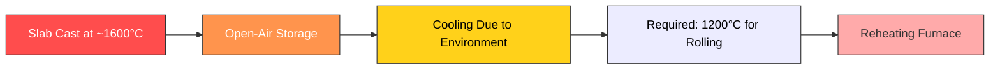
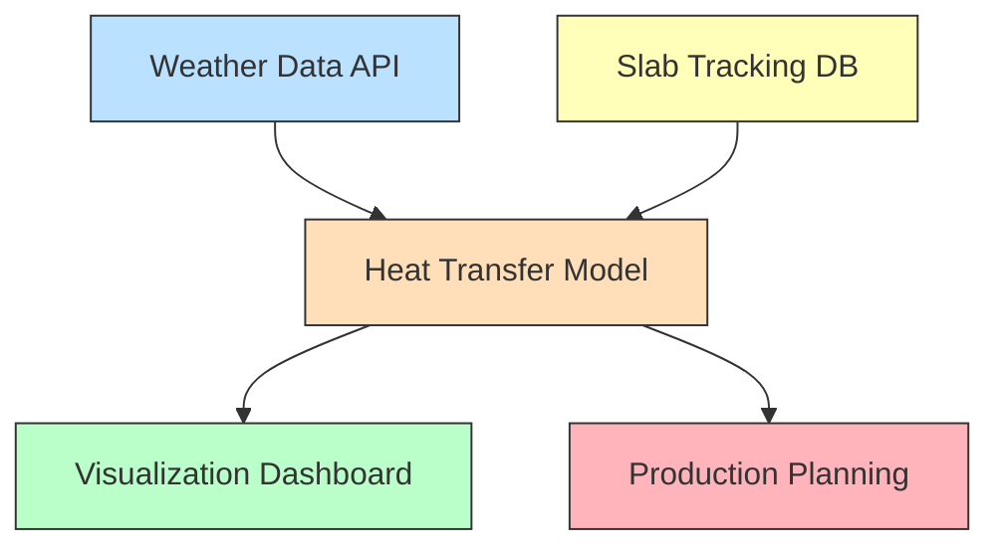

# Real-Time Steel Slab Temperature Estimation

In 2018, I collaborated with Tata Steel’s Customer Value Department in IJmuiden, the Netherlands, on a high-intensity, 14-week “SWAT” engineering project. The task was ambitious: build a real-time system to track the temperature of thousands of steel slabs as they moved from the steel plant to the hot strip mill — a journey that could last hours or even days in open-air storage.

The challenge was both physical and computational. Steel slabs are cast at around **1600 °C**, but the hot strip mill requires them to be at **1200 °C** before rolling. Every degree of unnecessary reheating costs energy and money; every degree underestimated risks poor product quality. The existing estimation method lacked precision, leaving significant efficiency gains untapped.

---

## Understanding the Problem

At its core, the problem was one of prediction: given varying weather conditions, slab positions, and storage times, how could we know each slab’s internal temperature at any given moment?

This meant building a model that could:
- Pull **real-time weather data**
- Query **internal slab tracking databases**
- Calculate **heat transfer** between slabs, the ground, and the environment
- Continuously update predictions for thousands of slabs

---

## Building the Model

My role focused on **integrating the model components** built by different engineers, managing our Git server, and ensuring stable software releases. This required aligning the interfaces between code modules, coordinating data formats, and overseeing the flow from raw plant data to final model outputs.

I also developed a visualization layer using **Bokeh** and **Plotly** to make simulation results immediately accessible. This included both web-based dashboards and command-line tools for debugging and rapid iteration.

Validation involved three complementary approaches:
1. Automated plant measurements
2. Manual slab temperature readings
3. Comparisons against a high-fidelity finite element model (FEM)

---

## Results and Impact

The accuracy gains over the production system were substantial with a **78% reduction** in root mean squared error (RMSE)  

With this level of precision, the system could allow production planners to schedule rolling and reheating far more efficiently. The estimated savings — if deployed in production — were on the order of *millions of euros annually*, alongside a measurable reduction in CO₂ emissions.

---

## Lessons and Next Steps

Despite the strong results, the project revealed some limitations. Performance and maintainability posed challenges for long-term scalability. In the final report, I recommended:

- Moving to an **FEM-based model** for higher spatial resolution and better surface temperature correction
- Implementing **multiprocessing or GPU acceleration** to reduce runtimes
- Improve the architecture to improve maintainability

These changes could push the model towards even faster, more detailed, real-time performance.

---

This was my first real experience building and deploying production-grade software in an industrial environment — blending applied physics, data integration, and software engineering.

---

  
<strong>View Full Project Report (PDF)</strong>

  <iframe 
    src="https://media.licdn.com/dms/document/media/v2/C4D2DAQH0Ktxv9VQ5Cw/profile-treasury-document-pdf-analyzed/profile-treasury-document-pdf-analyzed/0/1583811683388?e=1755734400&v=beta&t=qfkEPxC88MNKtKV2CES7IoK3l38sCQiiSrJHv1K67qM" 
    width="100%" 
    height="600px" 
    style="border:none; margin-top:10px;">
  </iframe>

