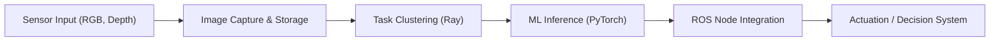
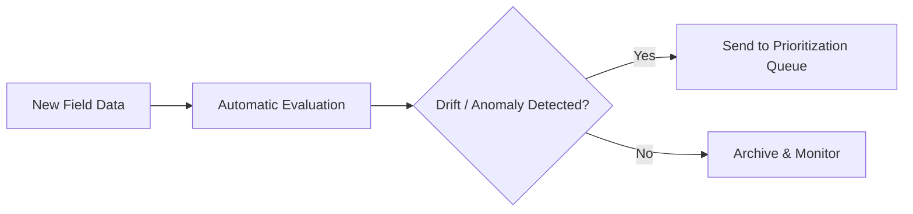

From 2021 to 2023, I worked as a Machine Learning and Computer Vision Engineer at **Tortuga AgTech**, a robotics company building autonomous systems for high-precision agriculture. I joined a small but highly capable perception team focused on solving the real-world challenges of deploying CV/ML pipelines in harsh, variable outdoor environments - with all the unpredictability that comes with real farms and robots in the field.

My work spanned the full ML lifecycle. I helped design and build the infrastructure and modeling systems that enabled robots to reliably see, understand, and act on their surroundings - from identifying fruits and obstacles to making actuation decisions in real time. One of my core responsibilities was building out an end-to-end ML pipeline that handled everything from data ingestion and annotation tooling to training, validation, deployment, and monitoring.

### ML Pipelines for Real-Time Robotics

To support our robots in the field, I developed modular pipelines for managing computer vision workflows. These pipelines were designed to be reproducible, scalable, and field-tested. We relied heavily on PyTorch, Postgres, and AWS for experimentation, and on optimized containers running on remote nodes for deployment.

The key challenge was balancing performance and reliability. We couldn’t afford flaky inference or long latencies - everything had to run on-device, in real-time, without sacrificing interpretability or debuggability. I worked closely with embedded engineers and roboticists to tune inference performance and memory usage.

### Intelligent Task Clustering with Ray

One particularly interesting problem involved scaling up training data workflows. As the robot fleet grew, we needed smarter strategies for prioritizing which images should be labeled, reprocessed, or re-inferred. I built a system using **Ray** to cluster and schedule computer vision tasks dynamically across large datasets.

This allowed us to:

* Group similar image tasks to reduce labeling redundancy
* Surface edge cases and uncertainty clusters
* Run re-inference or re-training workflows in parallel across GPUs

It started as a lightweight scheduling tool and evolved into a core part of our ML operations stack.

### Field-Driven Evaluation

Beyond model performance metrics, we cared deeply about behavior in production. I created evaluation dashboards and drift detection tools that helped us track changes over time, spot edge cases, and diagnose issues across environments. We built tooling to group and visualize failure modes by cluster and environment - giving the team fast feedback loops between deployment and model improvement.

### Looking Back

My time at Tortuga was formative - it taught me how to think in systems, not just models. I learned to balance engineering pragmatism with research curiosity, and to build machine learning tools that work not just on paper but under the sun, rain, and dirt of real-world deployments. It was a hands-on education in scalable ML, robotics constraints, and cross-disciplinary collaboration.

That experience continues to inform my consulting work today, especially in projects where machine learning needs to operate outside the lab.
